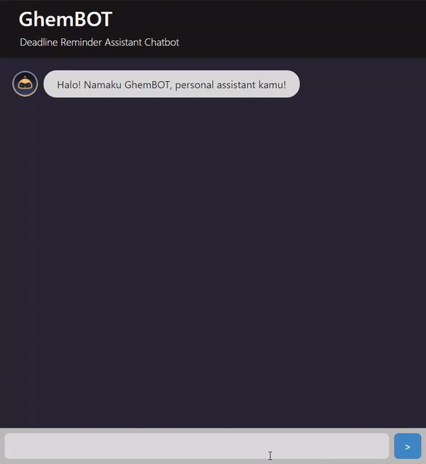

# GhemBOT

> Personal Deadline Reminder Assistant



[**Live Demo**](ghembot.netlify.app)

| Anggota                 | NIM      |
| ----------------------- | -------- |
| Dionisius Darryl H.     | 13519058 |
| Nathaniel Jason         | 13519108 |
| Gregorius Dimas Baskara | 13519190 |

## General Info

GhemBOT is a personal deadline reminder assistant that can help you organize all the deadlines that you have whether it is an exam, quiz, or project. This bot is developed using ReactJS and Flask. GhemBOT uses various string and pattern matching techniques such as Knuth–Morris–Pratt algorithm and Regular Expression.

## Backend

### Activating venv

This step is optional, but recommended.  
**Linux**  
`source project_env/bin/activate`

**Windows CMD**  
`./project_env_win/Scripts/activate.bat`

**Windows PowerShell**  
`./project_env_win/Scripts/Activate.ps1`

### Deactivating venv

`deactivate`

### Adding dependencies

1. activate the venv
2. use `pip install` to add dependencies
3. `pip freeze`
4. copy the result of pip freeze to `requirements.txt`

### Installing dependencies

`pip install -r requirements.txt`

### Running flask

**Windows PowerShell**

```
$env:FLASK_APP = "main.py"
flask run
```

## Frontend

1. Navigate into `./src/frontend`
2. Install all the dependencies with `npm install`
3. To run the app, simply execute `npm start`
